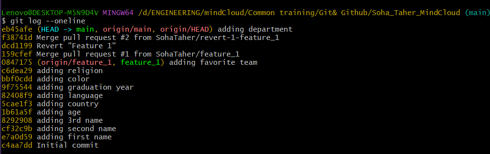

# My personal data
## My name
`Soha Taher`
## My age
21
## My department
Communication and Electronics Department
## My favorite team
Software
# Clonning my repo
You can clone my repo by the following command
```
git clone https://github.com/SohaTaher/Soha_Taher_MindCloud.git
```
# Following me on GitHub
* You can find my GitHub account
  * [here](https://github.com/SohaTaher)
# The required screenshots
## Commits



